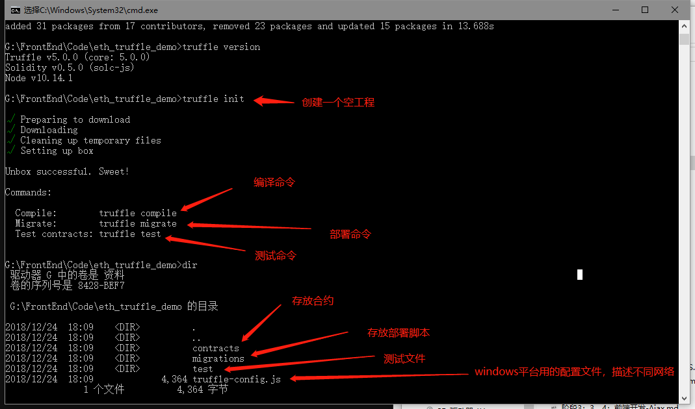

# eth_truffle_demo
truffle框架，以及truffle框架内置React使用说明。


### 一、Truffle安装

```shell
npm install -g truffle
# 验证安装
truffle version
```


### 二、创建工程

#### 1、准备工作

```shell
# 新建一个空目录
mkdier eth_truffle_demo
# 进入目录
cd eth_truffle_demo
```

#### 2、truffle 初始化创建工程

初始化工程有时候会失败，把truffle重新安装下再执行下面命令就行了

```shell
truffle init
```



初始化项目后，生成上图对应的文件

> contracts  		存放合约
>
> migrations 		存放部署脚本
>
> test 			存放测试文件
> truffle-config	.js	windows平台用的配置文件，linux和Mac的是truffle.js，如果有两个，则要把linux那个删掉，不然会有问题

### 三、Truffle 编译合约

Goland IDE导入项目后，要记得配置node编译环境，具体的在设置里-->Languages-->Javascript-->Libraries-->Add

truffle工程下执行指令，windows平台下有坑，要注意

最近下的版本合约需要指定一个最低版本了

```shell
# 旧版
pragma solidity ^0.4.24;
# 新版
pragma solidity >=0.4.24 <0.6.0;
```

```shell
# windows
truffle.cmd compile
# linux 
truffle compile
```

编译完成后，可获取abi


### 四、部署

#### 1、添加部署脚本

> migrations下的js文件命名遵循一定标准
> 如：1_initial_migration.js
> 如：2_simpleStorage_migration.sol.js

```
编号_名称_后缀
```

```js
var SimpleStorage = artifacts.require("./SimpleStorage.sol");

module.exports = function (deployer) {
    deployer.deploy(SimpleStorage);
};
```

#### 2、修改配置文件

truffle.js是非windows平台的配置文件，windows使用truffle-coinfig.js。

配置到如下节点下，可以配置多个，每个配置之间用 , 号分割开

```js
module.exports = {
    networks: {    
        // 网络起的名字，自己定义的
        testNet: {
            host: "127.0.0.1",
            port: 8545,
            network_id: "*" // Match any network id
        }
    },
........
}

```

#### 3、部署合约

部署前需要下载这两个插件

```shell
npm install truffle-hdwallet-provider@0.0.3 --save
npm install -g ganache-cli
```

```shell
# windows 下执行
truffle.cmd migrate --network testNet
# Linux
truffle migrate --network testNet
```


### 四、Truffle 搭建服务器

truffle搭建服务器  

```shell
# windows 下执行
truffle.cmd develop
# Linux
truffle develop
```

1、终端内直接部署合约

```shell
migrate
```

### 五、Truffle内置React框架

https://github.com/truffle-box/react-box

直接按官网那种方式是下载不下来的，直接找到github上下源码，链接在上面，然后进入到client目录找到package.json文件

```shell
"dependencies": {
    "react": "^16.7.0",
    "react-dom": "^16.7.0",
    "react-scripts": "^2.1.1",
    "web3": "^1.0.0-beta.37"
  },
```

把上面这些依赖，一个一个用npm下下来

先启动develop环境

```shell
truffle develop
# 编译合约
compile
# 部署合约
migrate
# 部署过合约的话，重新部署合约
migrate --reset
```

进入client目录执行下面命令

```shell
npm run start
```

注意：MetaMask连接的时候要用http://192.168.0.9:9545不要用127.0.0.1:9545否则会连接不上


